# Laporan Praktikum
| MatKul | Pemrograman Berbasis Framework |
| ---    | ---           |
| Nama   | Faricha Aulia |
| NIM    | 2141720155    |
| Kelas  | TI - 3I       |

<table><tr><td>Saya melampirkan screenshot dari setiap step yang saya lakukan pada src/assets</td></tr></table>
<table><tr><td>Namun, saya memiliki permasalahan yaitu style buttonnya tidak muncul. Namun fungsinya masih bekerja. </td></tr></table>

## Praktikum 1
Tampilan web : 
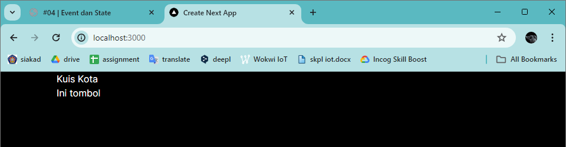
 
Saat cursor diarahkan ke tombol : 
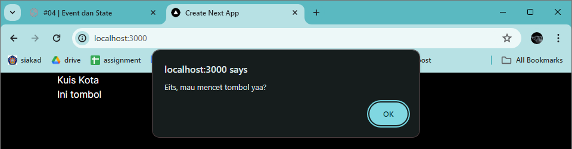
 
Saat cursor dialihkan dari tombol : 

 
Saat tombol ditekan : 
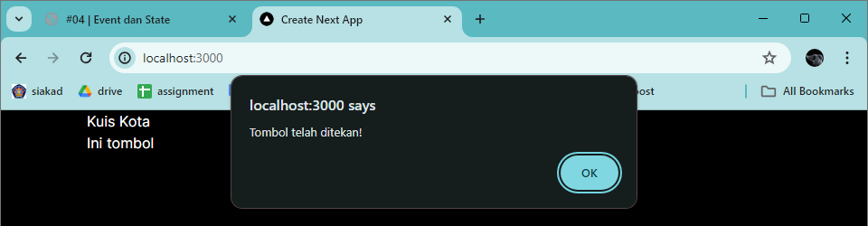

---

## Praktikum 2
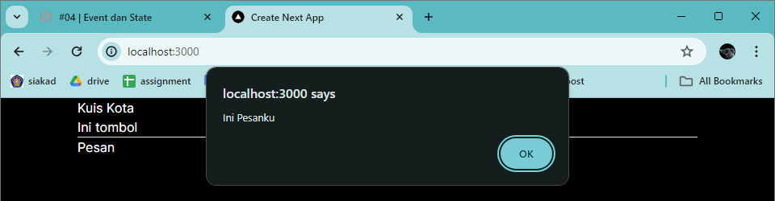
**Penjelasan :**
Ketika tombol "Pesan" ditekan, sebuah kotak alert akan muncul dengan pesan "Ini Pesanku". Karena di dalam komponen Tombol_2, Anda telah menambahkan event listener onClick pada tombol tersebut. Ketika tombol ditekan, fungsi alert(isiPesan) akan dipanggil, yang akan menampilkan kotak dialog dengan pesan yang diberikan melalui properti isiPesan.

---

## Praktikum 3

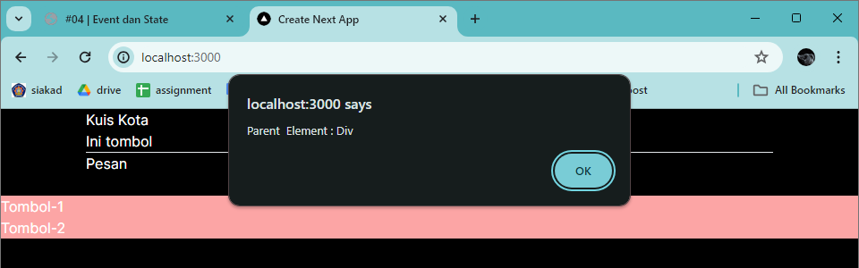
 
Setelah propagation dihentikan : 
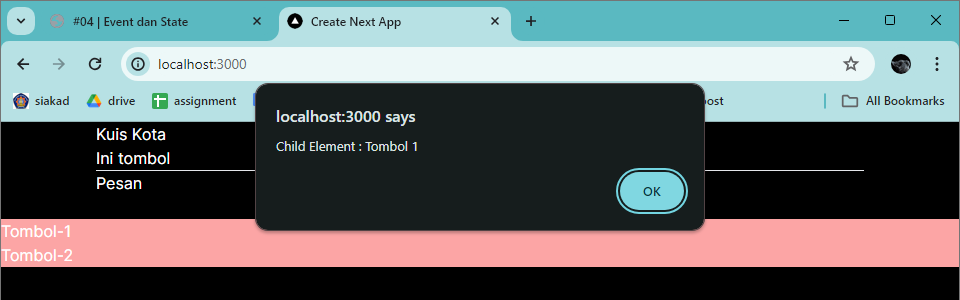
--- 

## Praktikum 4
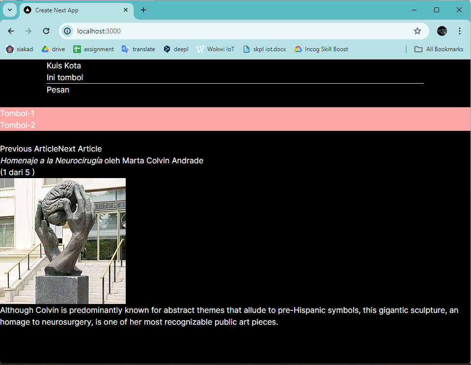
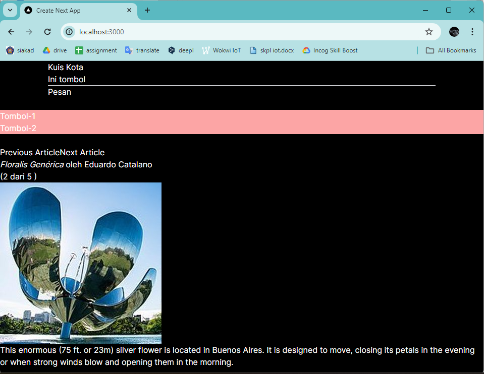
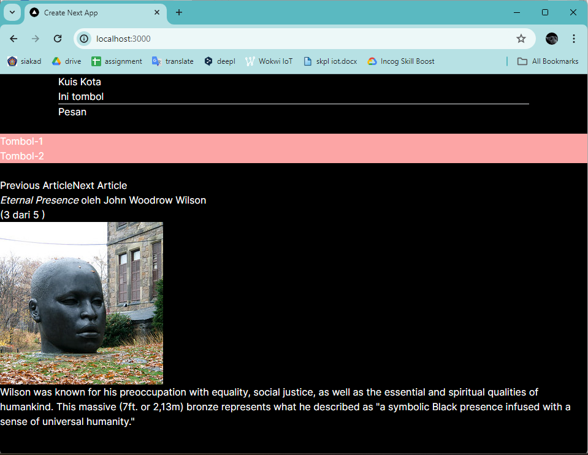
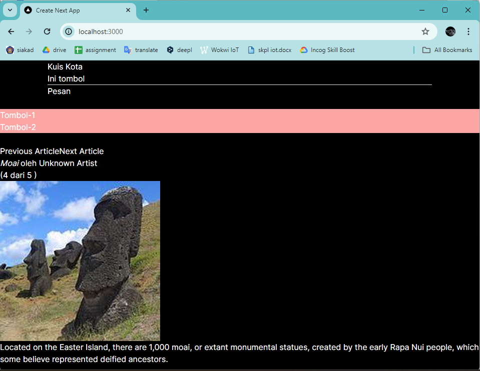
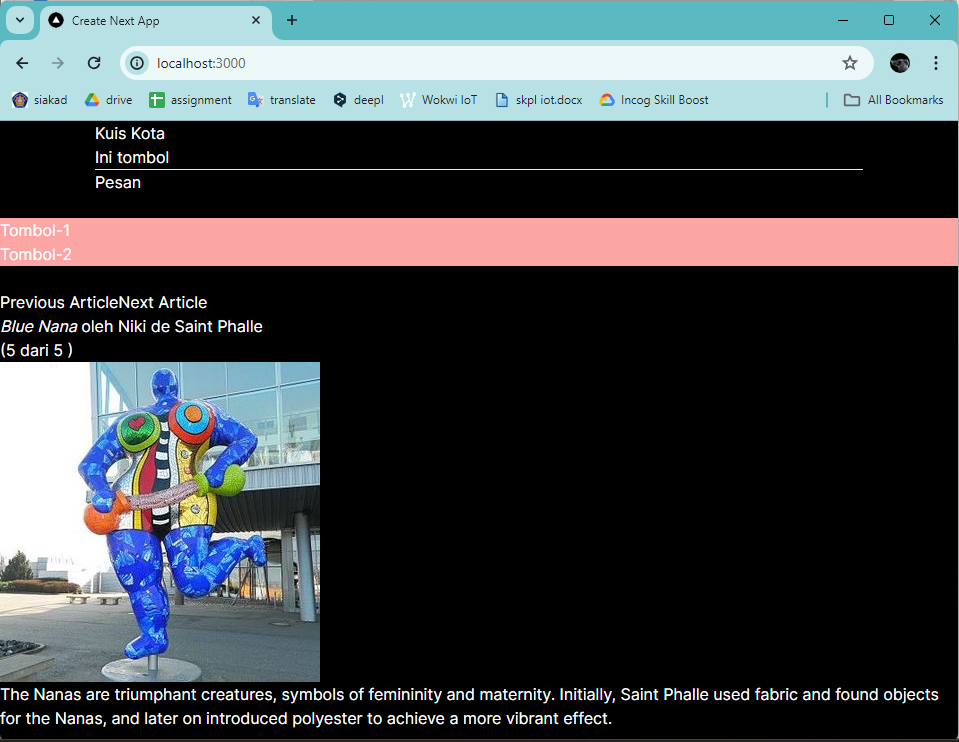

---

## Praktikum 5
Tebak hewan : 
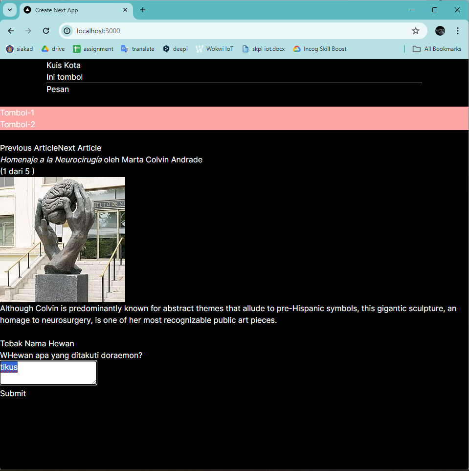
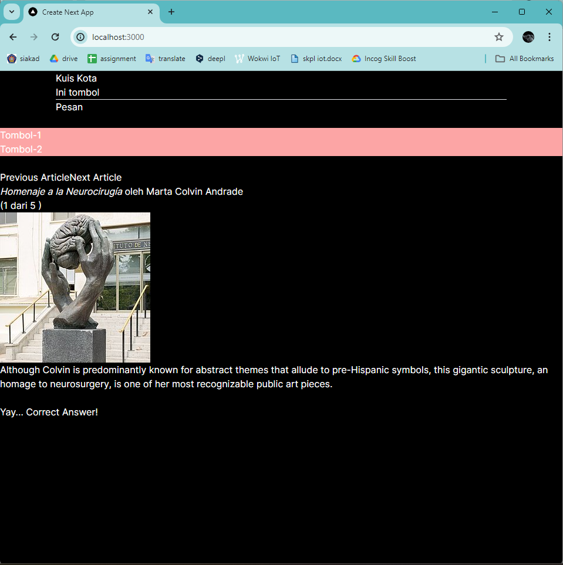

Form nama : 
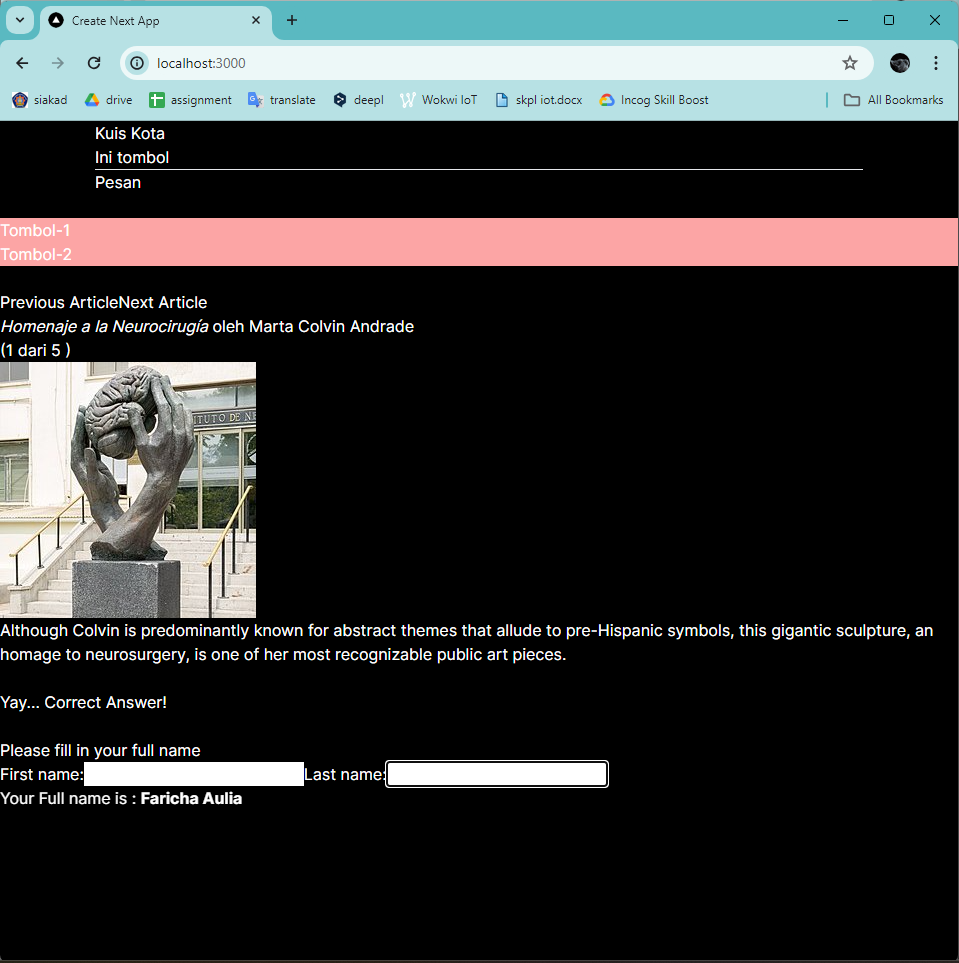

**Perbedaan** antara kedua komponen tersebut adalah:
- Form memiliki logika validasi dan pengiriman data ke server, sedangkan Form_2 hanya menampilkan dan memperbarui nilai input fields secara real-time.
- Form menggunakan textarea sebagai input, sedangkan Form_2 menggunakan input fields teks.
- Form memiliki state yang lebih kompleks (answer, error, status), sedangkan Form_2 hanya memiliki state untuk firstName dan lastName.

**Keuntungan menghapus state fullName:**
Pada komponen Form_2, nilai fullName dihitung secara real-time dari kombinasi firstName dan lastName. Ini berarti bahwa nilai fullName tidak perlu disimpan dalam state karena bisa dihitung setiap kali firstName atau lastName berubah.

---

## Praktikum 6
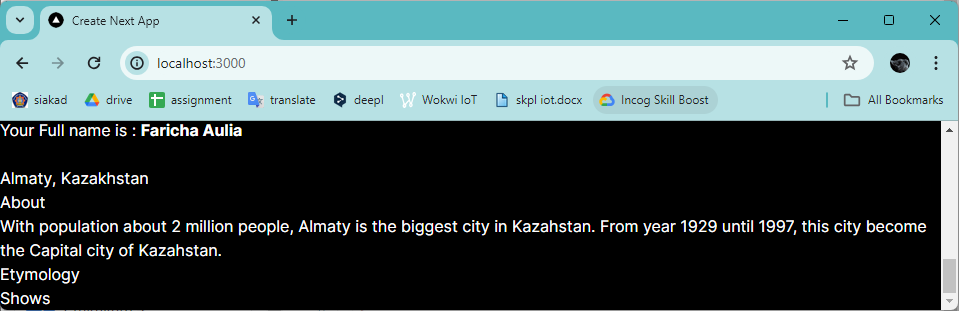
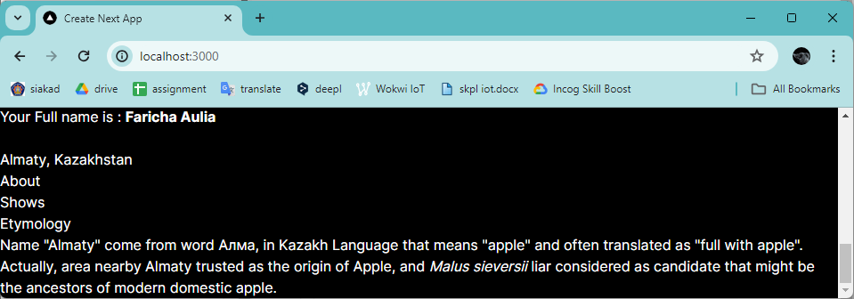

Form chat : 
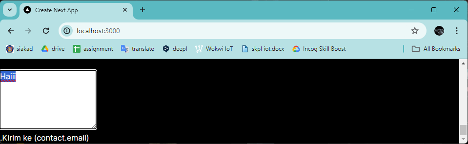

**Penjelasan :**
1. Tujuan dari penulisan key={to.email} pada <Chat key={to.email} contact={to} /> adalah untuk memberikan sebuah identitas unik pada setiap elemen Chat yang dirender. Dalam kasus ini, nilai email dari objek contact (to.email) digunakan sebagai kunci unik untuk setiap elemen Chat.
2. Fungsi dari props key dalam React adalah untuk membantu React mengidentifikasi secara unik setiap elemen dalam sebuah daftar yang dirender. Ketika sebuah daftar dirender ulang, React akan menggunakan key untuk menentukan elemen mana yang telah diubah, ditambahkan, atau dihapus. Dengan demikian, React dapat mengoptimalkan proses render dan hanya memperbarui elemen yang berubah, daripada merender ulang seluruh daftar secara tidak efisien.

---
